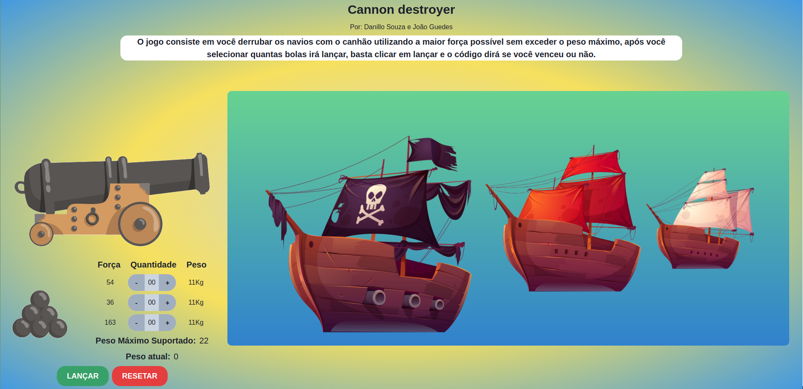
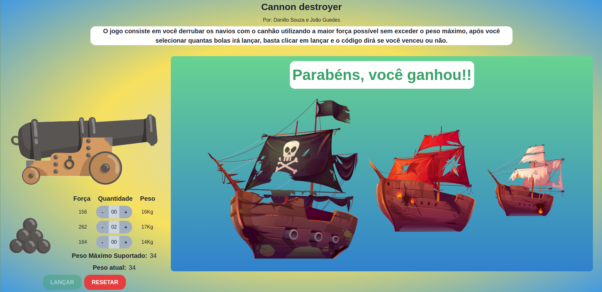
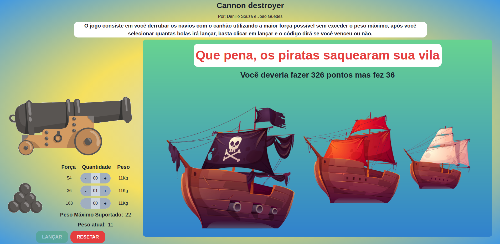

# Greed-CannonDestroyer

# Cannon Destroyer

**Número da Lista**: 3<br>
**Conteúdo da Disciplina**: Greed (Knapsack)<br>

## Alunos
|Matrícula | Aluno |
| -- | -- |
| 17/0139981 |  Danillo Gonçalves de Souza |
| 17/0013910 |  Joao Pedro Jose Santos da Silva Guedes |

## Sobre 
O objetivo do projeto é a aplicação dos conteúdos da disciplina Projeto de Algoritmos em um contexto real. O contexto selecionado pela dupla foi a criação de um jogo onde o jogador deve derrubar os navios piratas com a maior força possível sem ultrapassar o peso limite. Por trás deste jogo estão sendo aplicados conceitos de **Knapsack**.

## Screenshots





## Instalação 
**Linguagem**: Javascript<br>
**Framework**: ReactJS<br>
Para rodar o projeto você precisará instalar na sua máquina:
- [Node.js](https://nodejs.org/en/)
- [Yarn](https://yarnpkg.com/)

Para rodar o projeto basta executar os seguintes comandos dentro da pasta cannon-destroyer

**Utilizando yarn**
```
yarn
yarn start
```


## Uso 
Após executar automaticamente ele abrirá uma aba no seu navegador com o projeto rodando, caso isto não aconteça basta acessar seu localhost com a porta indicada no terminal ao executar os comandos.
